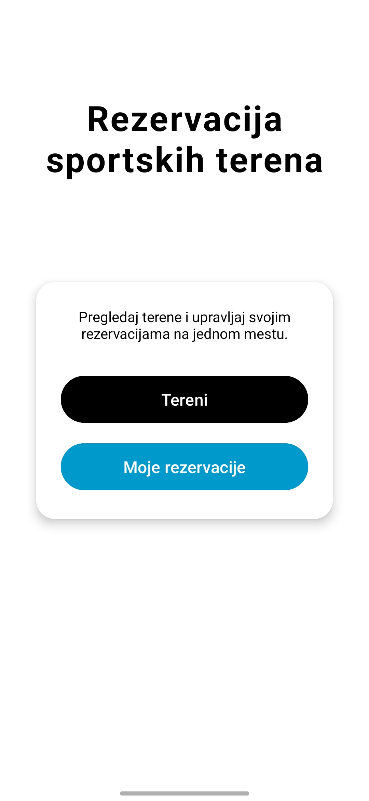
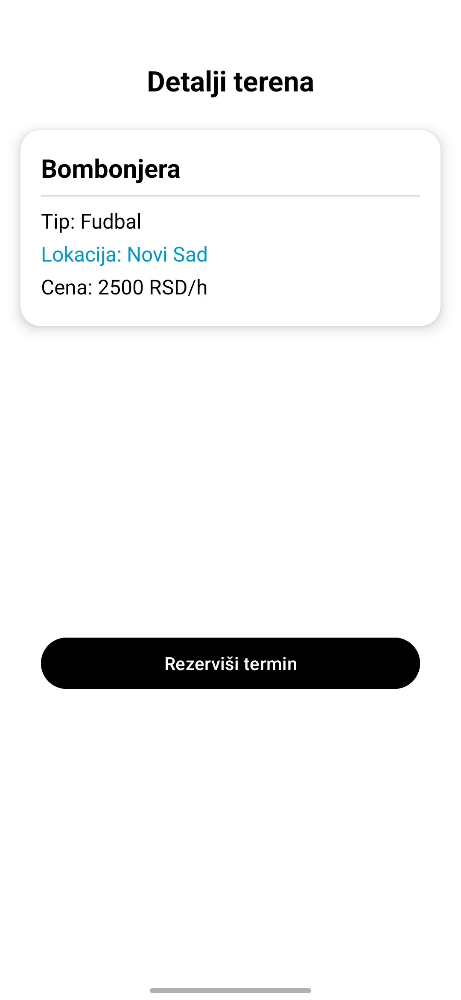
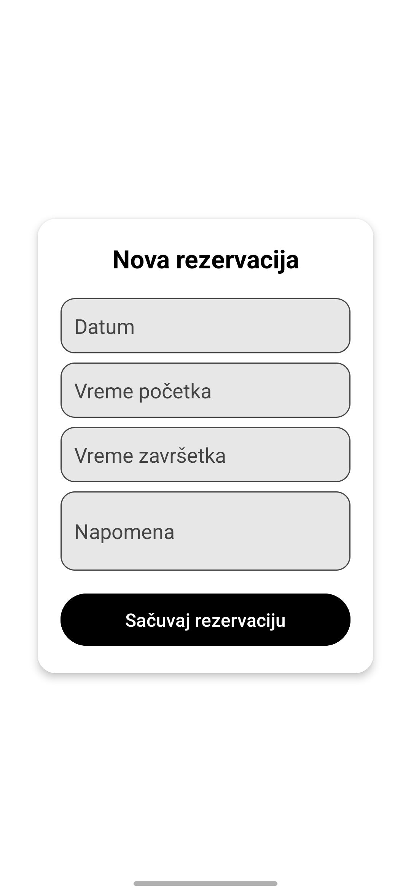
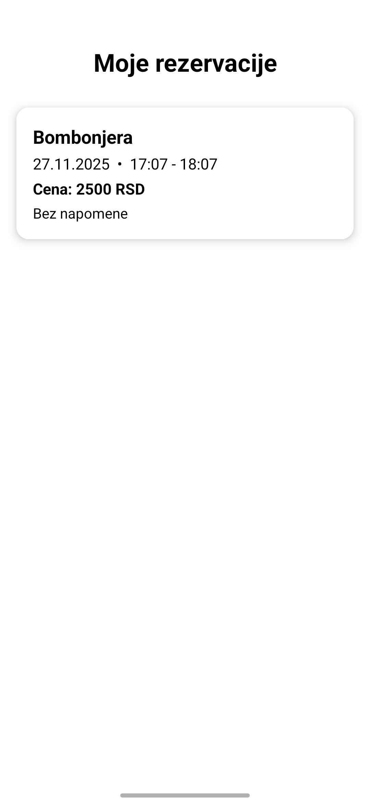

**SRB**

# RMA – Aplikacija za rezervaciju sportskih terena (Android Studio)

Android aplikacija namenjena rezervaciji sportskih terena.  
Korisnicima omogućava pregled slobodnih termina, kreiranje rezervacija i upravljanje sopstvenim rezervacijama.

## Funkcionalnosti
- Pregled dostupnih sportskih terena i termina
- Kreiranje i otkazivanje rezervacija
- Čuvanje podataka u lokalnoj bazi (Room / SQLite)
- Jednostavan i intuitivan korisnički interfejs

## Korišćene tehnologije
- Java
- Android SDK
- Room (SQLite)
- Gradle

## Čuvanje podataka
Aplikacija koristi **lokalnu Room bazu podataka** za čuvanje rezervacija.  
Podaci se čuvaju lokalno na uređaju i brišu se prilikom deinstalacije aplikacije.

## Pokretanje aplikacije
1. Klonirati repozitorijum:
   ```bash
   git clone https://github.com/Aletokul/RMA.git
   ```
2. Otvoriti projekat u Android Studio
3. Pokrenuti aplikaciju

## Napomena
Projekat je razvijen kao studentski projekat u cilju demonstracije rada sa Android aplikacijama, lokalnom bazom podataka i osnovnim UI komponentama.


<br>

---

## Screenshots

<table>
   <tr>
      <td>Početna/Home</td>
      <td>Lista terena/List of fields</td>
      <td>Detalji terena/Field details</td>
      <td>Rezervacija/Reservation</td>
      <td>Moje rezervacije/My reservations</td>
   </tr>
   <tr>
      <td></td>
      <td></td>
      <td></td>
      <td></td>
      <td></td>
   </tr>
</table>

---

**ENG**
# RMA – Sports Field Reservation App (Android Studio)

Android application for reserving sports fields.  
The app allows users to view available time slots, create reservations, and manage their reservations.

## Features
- View available sports fields and time slots
- Create and cancel reservations
- Local data persistence using Room (SQLite)
- Simple and intuitive user interface

## Tech Stack
- Java
- Android SDK
- Room (SQLite)
- Gradle

## Data Storage
The application uses a **local Room database** to store reservation data.  
All data is saved locally on the device and recreated on a fresh install.

## How to Run
1. Clone the repository:
   ```bash
   git clone https://github.com/Aletokul/RMA.git
   ```
2. Open the project in Android Studio
3. Run the app

## Note
This project was created as a student project to demonstrate Android application development concepts such as local persistence, UI components, and project structure.
